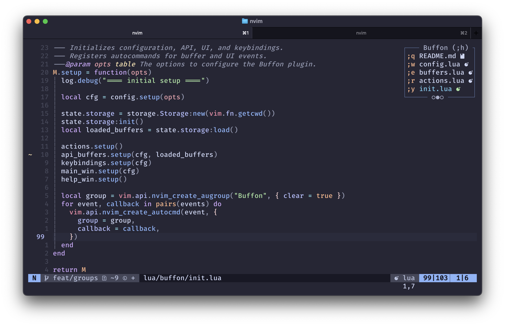
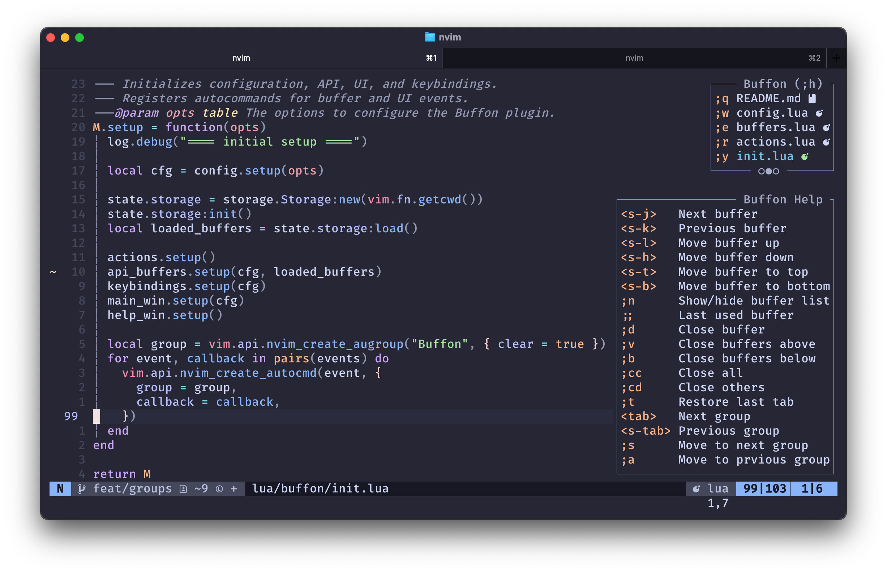

# Buffon


<div align="center">
    
</div>


*Buffon* is yet another plugin for navigating between buffers in [Neovim](https://neovim.io/). The name *Buffon* comes from the combination of *Buffer* and *Navigation*, creating the amusing word *buffon*, referencing the medieval jester who entertained the king.

This plugin is inspired by [harpoon](https://github.com/ThePrimeagen/harpoon) and [tide](https://github.com/jackMort/tide.nvim). Both are fantastic, but they didn't quite fit my workflow.

Things I like and dislike about these plugins:

| `Harpoon` | `Likes`               | `Dislikes` |
|----      |----                  |----       |
| | * Data persistence    | * Having to select which buffers to work with |
|           | * Buffers can be sorted | * Constantly having to open and close the window to see which buffers are selected, change the order, delete them, etc. |
|           | * Good API | |
|           | * Tests | |

| `Tide` | `Likes`               | `Dislikes` |
|----      |----                  |----       |
| | * Pleasant and beautiful interface | * Having to select which buffers to work with |
|           | * Shortcuts to access a buffer directly | * Buffers cannot be sorted |
|           | * Always having the buffer list visible | * No persistence |

Based on this, I created *Buffon* with the best of both plugins, perfectly adapting to my way of working.

## What Buffon offers

* Simple and minimalist interface
* Always visible interface
* Data persistence, storing the cursor position
* Works with **all** open buffers
* Buffers can be:
  * Sorted: Move one position up/down, send to the beginning or end of the list
  * Closed: You can close one buffer, all, those above, those below, or the "others"
  * Navigate between previous and next buffer
  * Access a specific buffer
  * Toggle between the last used buffer
  * Reopen closed buffer
* Help window to see the shortcuts

> [!NOTE]
> If you like all these features and the plugin also adapts to your needs, I would greatly appreciate it if you **click on the star**.

## Installation

> [!NOTE]
> require neovim 0.10.0+

* Using [lazy](https://github.com/folke/lazy.nvim):

Option 1:

```lua
return {
  {
    "francescarpi/buffon.nvim",
    opts = {},
    dependencies = {
      "nvim-tree/nvim-web-devicons",
      "nvim-lua/plenary.nvim",
    },
  },
}
```

Option 2:

```lua
return {
  {
    "francescarpi/buffon.nvim",
    dependencies = {
      "nvim-tree/nvim-web-devicons",
      "nvim-lua/plenary.nvim",
    },
    config = function()
      require("buffon").setup()
    end
  },
}
```

## Default Configuration

Below you can see the default configuration, which you can adjust to your liking in the setup. For example:

```lua
return {
  {
    "francescarpi/buffon.nvim",
    opts = {
      cyclic_navigation = true,
    },
    dependencies = {
      "nvim-tree/nvim-web-devicons",
      "nvim-lua/plenary.nvim",
    },
  },
}
```

Default configuration:

Take a look at the default shortcuts for navigating between buffers, changing their order, or closing them:


```lua
{
  cyclic_navigation = false,
  prepend_buffers = false,
  open = {
    by_default = false,
    ignore_ft = { "gitcommit" },
  },
  keybindings = {
    goto_next_buffer = "<s-j>",
    goto_previous_buffer = "<s-k>",
    move_buffer_up = "<s-l>",
    move_buffer_down = "<s-h>",
    move_buffer_top = "<s-t>",
    move_buffer_bottom = "<s-b>",
    toggle_buffon_window = ";a",
    switch_previous_used_buffer = ";;",
    close_buffer = ";d",
    close_buffers_above = ";v",
    close_buffers_below = ";b",
    close_all_buffers = ";cc",
    close_others = ";cd",
    restore_last_closed_buffer = ";t",
    buffer_mapping = {
        mapping_chars = "qweryuiop",
        leader_key = ";",
    },
    show_help = ";h",
  },
}
```

## Screenshots

Buffon window, showing the buffer list:



Showing the help window:



## API

All the core functionalities in charge of managing the buffer list are located in the *api.lua* file. There are now functions to add elements, remove them, change the order, etc.

In the *actions.lua* file you can see how the API is used.

## Contribution

You are welcome to propose improvements, report bugs, or send pull requests. Keep in mind that for a PR to be accepted, it must pass the various CI checks, such as tests or the linter.

To run the tests locally, it is necessary to follow these steps:

```bash
cd buffon.nvim
mkdir packages
git clone https://github.com/nvim-lua/plenary.nvim.git packages/plenary.nvim
git clone https://github.com/nvim-tree/nvim-web-devicons.git packages/nvim-web-devicons
make test
```

### Project Structure

I have tried to organize the code in the best way I knew how, although it can surely be improved. Below I explain how it is structured:

* lua: Project code
    * api: Plugin core. Functionalities related to managing the buffer list
    * keybindings: Registration of the different shortcuts to the plugin actions
    * actions: Buffon actions linked with the keybindings
    * config: Configuration management
    * log: Log handling
    * storage: Responsible for persisting the buffer list to disk
    * ui: Folder with the two interface views, the main one and the help one
    * types: Contains all the project types
* tests: Test code

### Development branch

The integration branch will always be **develop**. All pull requests should be directed to this branch. When the code is stable, the repository owner will merge the changes from *develop* to *main* to release a new version.

> [!NOTE]
> I don't know the impact this plugin will have, but if it grows a lot or there is a lot of movement, I will be unable to maintain it and will need help from one or two maintainers.

**I hope you like it and enjoy it!**

